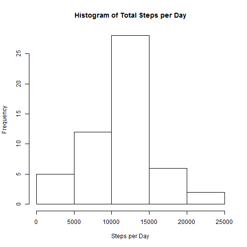
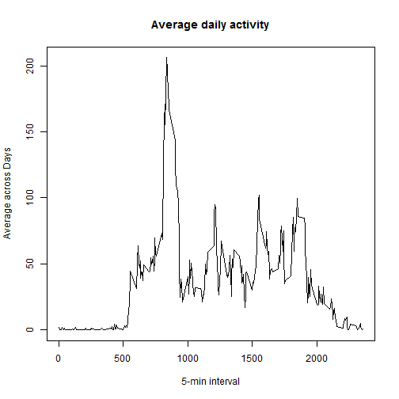
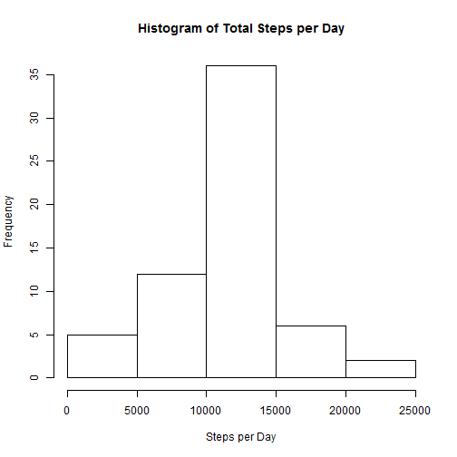
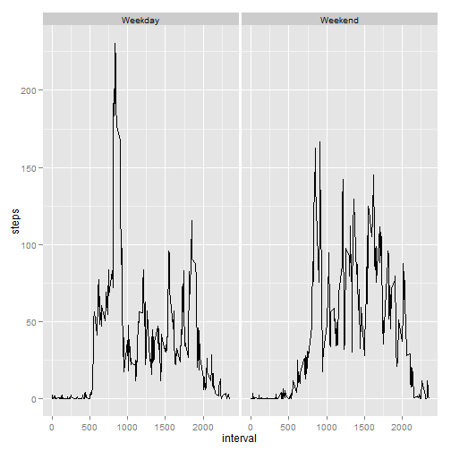

Matt's Analysis of Step Data
===================================================

This document details my analysis of a set of data about step activity over 5 minute intervals from October and November 2012.
## Loading and preprocessing the data
Here, the data is read in and a sample is displayed.

```r
  data <- read.csv("D:/Work/activity.csv")
  head(data)
```

```
##   steps       date interval
## 1    NA 2012-10-01        0
## 2    NA 2012-10-01        5
## 3    NA 2012-10-01       10
## 4    NA 2012-10-01       15
## 5    NA 2012-10-01       20
## 6    NA 2012-10-01       25
```
## What is mean total number of steps taken per day?
Here I'll aggregate the data by date, removing the rows with 'NA' as the step value.

```r
  stepTotal <- aggregate(steps ~ date, data = data, sum, na.rm = T)
```
Now, I'll create a histogram of that aggregate.

```r
  hist(stepTotal$steps, main = 'Histogram of Total Steps per Day', xlab = 'Steps per Day')
```

 

The mean is:

```r
  mean(stepTotal$steps)
```

```
## [1] 10766.19
```
while the median is:

```r
  median(stepTotal$steps)
```

```
## [1] 10765
```

## What is the average daily activity pattern?
Here, I aggregate the data by interval and follow it by creating a time series plot of that data.

```r
  timeData <- aggregate(steps ~ interval, data = data, mean, na.rm = T)
  plot(timeData, type = "l", xlab = "5-min interval", ylab = "Average across Days", main = "Average daily activity")
```

 

If you're curious about which time interval, on average, contains the largest number of steps, that information is here.

```r
  max <- which.max(timeData$steps)
  timeData$interval[max]
```

```
## [1] 835
```

##Imputing missing values
The number of missing values from the original dataset is as follows:

```r
  print(sum(is.na(data)))
```

```
## [1] 2304
```

Here, I'll fill the NA value'd rows with the average for that time interval. I do this by finding all the rows where the steps value is empty. I then loop through and fill it with the average from the matching interval value.

```r
  data2 <- data
  subsetNA <- subset(data2, is.na(steps) == T)
  data2$timedatasteps <- timeData$steps[(match(timeData$interval,subsetNA$interval))]
  for (i in 1:nrow(data2)) {
   if(is.na(data2$steps[i]) == T) {
     data2$steps[i] <- data2$timedatasteps[i]
    }
  }
```
Now that we have all the data filled in, let's take another look at a histogram of the total steps per day, the mean, and the median. To do this, I'll first need to run another aggregate operation.

```r
  stepTotal2 <- aggregate(steps ~ date, data = data2, sum, na.rm = T)
  hist(stepTotal2$steps, main = 'Histogram of Total Steps per Day', xlab = 'Steps per Day')
```

 

```r
  mean(stepTotal2$steps)
```

```
## [1] 10766.19
```

```r
  median(stepTotal2$steps)
```

```
## [1] 10766.19
```
## Are there differences in activity patterns between weekdays and weekends?
Now, let's compare weekdays and weekends. We'll use the filled-in missing value dataset. First we'll add a column of what day of the week it is using the 'weekdays' function, then we'll create another column identifying its level: weekend or weekday. We'll then create an aggregate of steps by interval from that data.

```r
  data2$day <- weekdays(as.Date(data$date))
  for (i in 1:nrow(data2)) {
    if (data2$day[i] %in% c('Saturday', 'Sunday')) { 
     data2$dayType[i] <- 'Weekend'
   }
   else data2$dayType[i] <- 'Weekday'
  }
  data2Agg <- aggregate(steps ~ interval + dayType, data = data2, mean, na.rm = T)
  head(data2Agg)
```

```
##   interval dayType      steps
## 1        0 Weekday 2.25115304
## 2        5 Weekday 0.44528302
## 3       10 Weekday 0.17316562
## 4       15 Weekday 0.19790356
## 5       20 Weekday 0.09895178
## 6       25 Weekday 1.59035639
```
Now, we'll create plots comparing activity on the weekends versus activity during the week.

```r
  library(ggplot2)
```

```
## Warning: package 'ggplot2' was built under R version 3.1.2
```

```r
  qplot(interval, steps, data = data2Agg, facets = . ~ dayType, geom = 'line')
```

 
